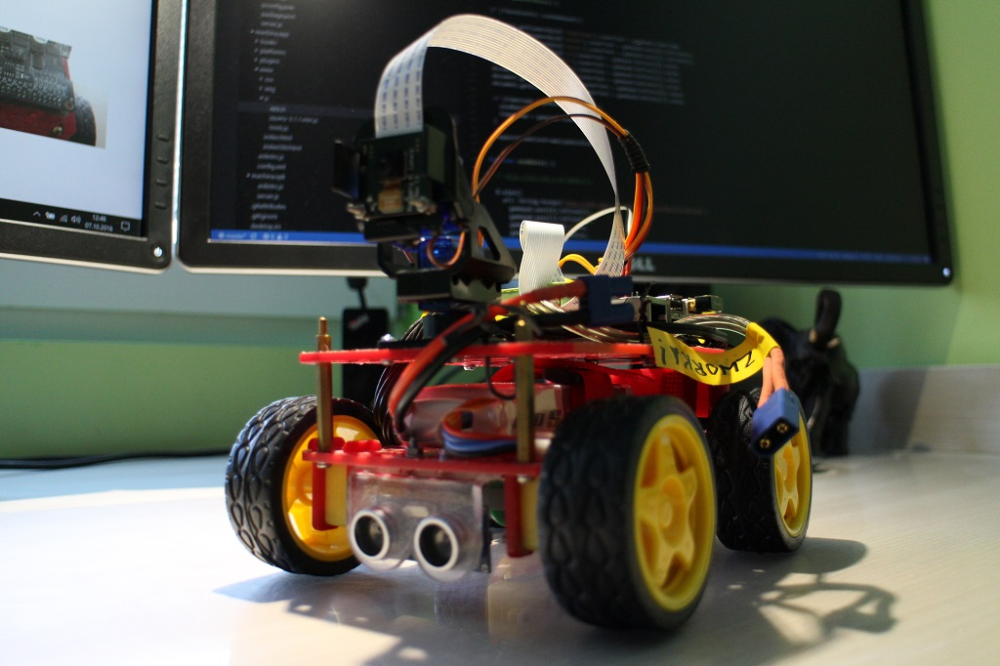

 
# Machina

Zdalne sterowanie robotem na bazie Raspberry Pi.

 

Projekt przede wszystkim ma na celu bawiąc/uczyć stosowania technologii JavaScript: Node.js i Cordova. Aby zacząć prace należy zaopatrzyć się w niezbędne podzespoły:

- komputer Raspberry Pi
- sterownik silników Motor Hat lub inny
- czterokołowe podwozie z silnikami
- kamerę
- taśmę 15 żył 30cm do kamery
- uchwyt do serw micro Pan/Tilt
- dwa micro serwa TowerPro SG-90 lub inne
- ultradźwiękowy czujnik odległości HC-SR04
- uchwyt montażowy do czujnika odległości HC-SR04
- akumulator/pakiet Li-Pol
- głośnik 0.1W

UWAGA: Podłączenie akumulatora przy zworce Motor Hat-a ustawionej na 5V spali Raspberry oraz sam sterownik!

[Proces instalacji oprogramowania](./docs/instalacja.md)

Założenia:

- pojazd ma poruszać się sterowany aplikacją na Androida z wykorzystaniem kontrolera do gier podłączonego przez USB OTG do telefonu
- w aplikacji na telefonie ma być dostępny podgląd obrazu z kamery
- czujnik odległości ma zabezpieczyć pojazd przed uderzeniem w przeszkodę uruchamiając na około 20cm przed nią automatyczne hamowanie
- bardziej zaawansowane funkcje do opracowania to np. skanowanie kamerą pomieszczenia w celu autonomicznego omijania przeszkód
- Raspberry docelowo ma być Access Pointem (hostapd?) aby uzyskać bezpośrednią łączność.

[Dyskusja na Facebook-u](https://www.facebook.com/groups/malinowepi/permalink/503939639776690/)

___
Maciej Tokarz © My-Poi!

